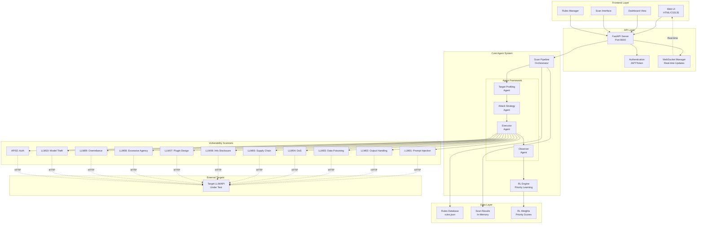
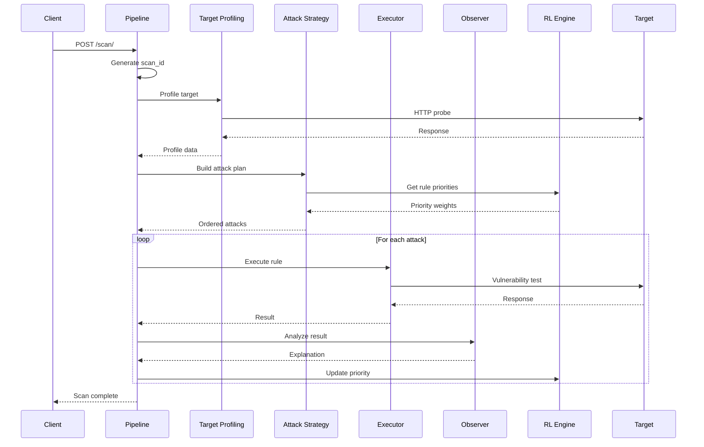
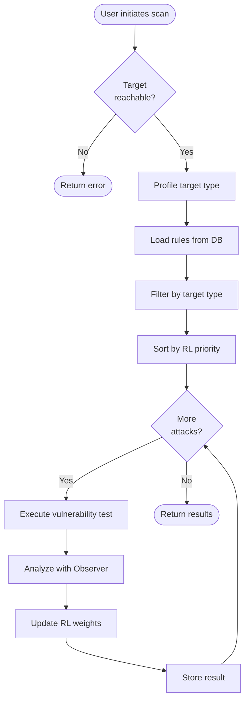

# AivulnHunter Architecture

## System Overview

AivulnHunter is an AI-powered vulnerability scanner designed to detect OWASP Top 10 for LLM Applications vulnerabilities in real-time. The system uses an agentic architecture with reinforcement learning to continuously improve detection accuracy.

## High-Level Architecture



## Component Details

### 1. Frontend Layer (`/frontend`)

**Purpose:** User interface for initiating scans and viewing results

**Components:**
- `index.html` - Main dashboard
- `scan.html` - Scan configuration and execution
- `rules.html` - Rule management interface
- `js/scan.js` - Scan orchestration logic
- `js/rules.js` - Rules CRUD operations
- `css/` - Styling

**Key Features:**
- Real-time scan progress via WebSocket
- Interactive vulnerability reports
- Rule priority visualization (heatmap)

---

### 2. API Layer (`/backend`)

**Purpose:** RESTful API and WebSocket server

**Main File:** `main.py`

**Endpoints:**
```
POST   /scan/              - Start new scan
GET    /scan/{scan_id}     - Get scan status/results
GET    /rules/             - List all rules
POST   /rules/             - Create new rule
PUT    /rules/{rule_id}    - Update rule
DELETE /rules/{rule_id}    - Delete rule
GET    /rl/stats           - Get RL learning stats
WS     /ws                 - WebSocket for real-time updates
```

**Authentication:** `dependencies/auth_guard.py`
- Token-based authentication
- Role-based access control (admin/user)

---

### 3. Agent Framework

#### 3.1 Target Profiling Agent (`agents/target_profiling.py`)

**Purpose:** Identify target type and assess reachability

**Process:**
1. Send HTTP request to target
2. Analyze response headers
3. Detect target type (LLM API, Web App, Generic API)
4. Return profile with risk assessment

**Output:**
```json
{
  "type": "LLM_API",
  "reachable": true,
  "risk_level": "MEDIUM",
  "headers": {...}
}
```

#### 3.2 Attack Strategy Agent (`agents/attack_strategy.py`)

**Purpose:** Build prioritized attack plan based on target profile

**Process:**
1. Load rules from database
2. Filter by target type
3. Sort by RL-learned priority weights
4. Return ordered attack list

**Output:**
```json
[
  {
    "rule": {...},
    "target": "http://...",
    "priority": 0.92
  }
]
```

#### 3.3 Executor Agent (`agents/executor.py`)

**Purpose:** Execute vulnerability tests against target

**Scanners Implemented:**
- `test_prompt_injection()` - LLM01
- `test_output_handling()` - LLM02
- `test_training_data_poisoning()` - LLM03
- `test_dos_vulnerability()` - LLM04
- `test_supply_chain()` - LLM05
- `test_sensitive_disclosure()` - LLM06
- `test_insecure_plugin()` - LLM07
- `test_excessive_agency()` - LLM08
- `test_overreliance()` - LLM09
- `test_model_theft()` - LLM10
- `test_api_security()` - API02

**Output:**
```json
{
  "status": "VULNERABLE",
  "confidence": 0.85,
  "explanation": "...",
  "mitigation": "...",
  "evidence": "..."
}
```

#### 3.4 Observer Agent (`agents/observer.py`)

**Purpose:** Analyze results and provide explainable AI outputs

**Features:**
- Context-specific explanations
- OWASP mapping
- Severity calculation
- Mitigation recommendations
- Optional LLM-powered analysis (Ollama)

**Output:**
```json
{
  "attack": "Prompt Injection",
  "why": "...",
  "mitigation": "...",
  "severity": "HIGH",
  "confidence": 0.85,
  "owasp_reference": "LLM01"
}
```

---

### 4. Scan Pipeline (`services/scan_pipeline.py`)

**Purpose:** Orchestrate the entire scan workflow

**Workflow:**



**Progress Tracking:**
- 0-25%: Target Profiling
- 25-50%: Attack Strategy
- 50-100%: Execute & Observe (per attack)

---

### 5. Reinforcement Learning Engine (`services/rl_engine.py`)

**Purpose:** Learn optimal rule priorities based on findings

**Algorithm:**
```python
new_priority = old_priority + learning_rate * reward
```

**Rewards:**
- CRITICAL/HIGH vulnerability found: +2
- MEDIUM/LOW vulnerability found: +1
- No vulnerability: +0

**State:**
- In-memory rule weights
- Persisted to file (future enhancement)

---

### 6. Data Models

#### Scan Object
```json
{
  "scan_id": "uuid",
  "target": "http://...",
  "status": "running|completed|error",
  "profile": {...},
  "results": [...],
  "started_at": "timestamp",
  "completed_at": "timestamp"
}
```

#### Rule Object
```json
{
  "id": 1,
  "name": "Prompt Injection",
  "owasp": "LLM01",
  "severity": "HIGH",
  "priority": 1
}
```

---

## Data Flow

### Scan Execution Flow



---

## Technology Stack

### Backend
- **Framework:** FastAPI (Python 3.10+)
- **HTTP Client:** requests
- **Async:** asyncio
- **WebSocket:** FastAPI WebSocket
- **Server:** Uvicorn

### Frontend
- **UI:** Vanilla HTML/CSS/JavaScript
- **Charts:** Chart.js (for heatmap)
- **HTTP:** Fetch API
- **WebSocket:** Native WebSocket API

### Data Storage
- **Rules:** JSON file (`rules/rules.json`)
- **Scans:** In-memory dictionary
- **RL Weights:** In-memory dictionary

---

## Security Considerations

### Authentication
- Token-based auth via `Authorization: Bearer <token>`
- Demo tokens: `demo-admin-token`, `demo-user-token`
- Role-based access control

### Testing Ethics
⚠️ **IMPORTANT:** Only test systems you own or have explicit permission to test
- All tests are designed to be non-destructive
- Tests probe behavior, not exploit vulnerabilities
- Rate limiting to prevent DoS

### Input Validation
- URL validation
- Scan type validation
- Rule schema validation

---

## Deployment

### Development
```bash
# Backend
cd backend
python3 main.py

# Frontend
cd frontend
python3 -m http.server 8080
```

### Production Considerations
- Use production ASGI server (Gunicorn + Uvicorn)
- Implement proper authentication (OAuth2, JWT)
- Add database (PostgreSQL) for persistence
- Add Redis for caching and job queues
- Containerize with Docker
- Add rate limiting and request throttling

---

## Testing Infrastructure

### Verification Scripts

1. **`verify_scanners.py`**
   - Unit tests for individual scanners
   - Mocked HTTP responses
   - Validates detection logic

2. **`verify_pipeline.py`**
   - End-to-end pipeline test
   - Mocked agents
   - Validates orchestration

3. **`vulnerable_app.py`**
   - Mock vulnerable LLM API
   - Intentionally vulnerable to all OWASP checks
   - Runs on port 9000

4. **`run_scan.py`**
   - Client script to trigger scans
   - Polls for results
   - Displays formatted report

---

## Future Enhancements

### Planned Features
1. **Database Integration**
   - PostgreSQL for scan history
   - User management
   - Audit logs

2. **Advanced RL**
   - Deep Q-Learning
   - Multi-armed bandit optimization
   - Contextual bandits for target-specific strategies

3. **LLM Integration**
   - Ollama for advanced analysis
   - GPT-4 for explanation generation
   - Custom fine-tuned models

4. **Reporting**
   - PDF export
   - SARIF format
   - Integration with SIEM tools

5. **Distributed Scanning**
   - Celery task queue
   - Multiple worker nodes
   - Horizontal scaling

---

## File Structure

```
AivulnHunter/
├── backend/
│   ├── main.py                 # FastAPI application
│   ├── agents/
│   │   ├── target_profiling.py
│   │   ├── attack_strategy.py
│   │   ├── executor.py
│   │   └── observer.py
│   ├── services/
│   │   ├── scan_pipeline.py
│   │   └── rl_engine.py
│   ├── routes/
│   │   ├── scan.py
│   │   ├── rules.py
│   │   └── rl_stats.py
│   ├── dependencies/
│   │   └── auth_guard.py
│   ├── rules/
│   │   └── rules.json
│   ├── ws_manager.py
│   ├── run_scan.py            # Test client
│   ├── vulnerable_app.py      # Mock target
│   ├── verify_scanners.py     # Unit tests
│   └── verify_pipeline.py     # Integration tests
├── frontend/
│   ├── index.html
│   ├── scan.html
│   ├── rules.html
│   ├── js/
│   │   ├── scan.js
│   │   └── rules.js
│   └── css/
│       └── styles.css
├── .gitignore
├── README.md
└── ARCHITECTURE.md            # This file
```

---

## API Reference

### Scan Endpoints

#### Start Scan
```http
POST /scan/
Content-Type: application/json
Authorization: Bearer <token>

{
  "target": "http://localhost:9000/chat",
  "scan_type": "full"
}

Response:
{
  "scan_id": "uuid",
  "target": "http://...",
  "status": "started",
  "results_url": "/scan/uuid"
}
```

#### Get Scan Status
```http
GET /scan/{scan_id}
Authorization: Bearer <token>

Response:
{
  "scan_id": "uuid",
  "status": "completed",
  "profile": {...},
  "results": [...]
}
```

### Rules Endpoints

#### List Rules
```http
GET /rules/
Authorization: Bearer <token>

Response:
[
  {
    "id": 1,
    "name": "Prompt Injection",
    "owasp": "LLM01",
    "severity": "HIGH",
    "priority": 1
  }
]
```

### RL Stats Endpoint

#### Get Learning Statistics
```http
GET /rl/stats
Authorization: Bearer <token>

Response:
{
  "weights": [
    {"rule": "Prompt Injection", "priority": 0.92},
    ...
  ]
}
```

---

## Contributing

### Adding New Scanners

1. Add rule to `rules/rules.json`
2. Implement test function in `agents/executor.py`
3. Add explanation to `agents/observer.py`
4. Update routing in `execute_rule()`
5. Add verification test

### Code Style
- Follow PEP 8
- Use type hints
- Document with docstrings
- Add error handling

---

## License
Nanthitha Venkatachalapathy

## Contact
nanthithav25@gmail.com

