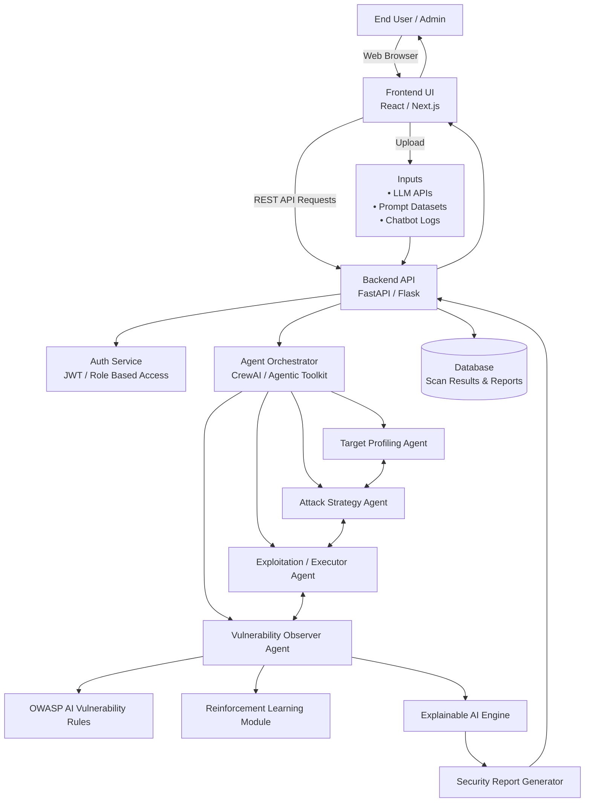

# AIVULNHUNTER

## 🏗️ System Architecture

```mermaid
flowchart TD

	U[End User / Admin] -->|Web Browser| FE[Frontend UI<br/>React / Next.js]
	FE -->|REST API Requests| BE[Backend API<br/>FastAPI / Flask]

	BE --> AUTH[Auth Service<br/>JWT / Role Based Access]

	FE -->|Upload| INPUTS[Inputs<br/>• LLM APIs<br/>• Prompt Datasets<br/>• Chatbot Logs]
	INPUTS --> BE

	BE --> ORCH[Agent Orchestrator<br/>CrewAI / Agentic Toolkit]

	ORCH --> A1[Target Profiling Agent]
	ORCH --> A2[Attack Strategy Agent]
	ORCH --> A3[Exploitation / Executor Agent]
	ORCH --> A4[Vulnerability Observer Agent]

	A1 <--> A2
	A2 <--> A3
	A3 <--> A4

	A4 --> OWASP[OWASP AI Vulnerability Rules]
	A4 --> RL[Reinforcement Learning Module]
	A4 --> XAI[Explainable AI Engine]

	BE --> DB[(Database<br/>Scan Results & Reports)]

	XAI --> REPORT[Security Report Generator]
	REPORT --> BE
	BE --> FE
	FE --> U
```

---