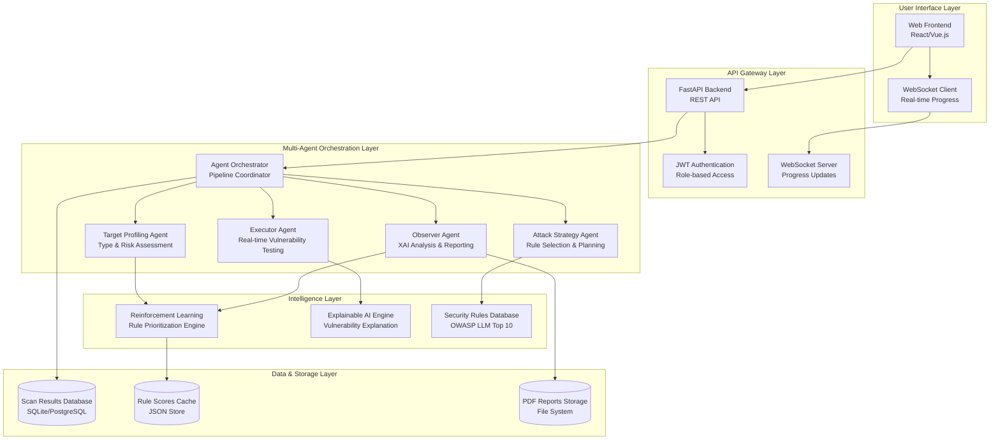
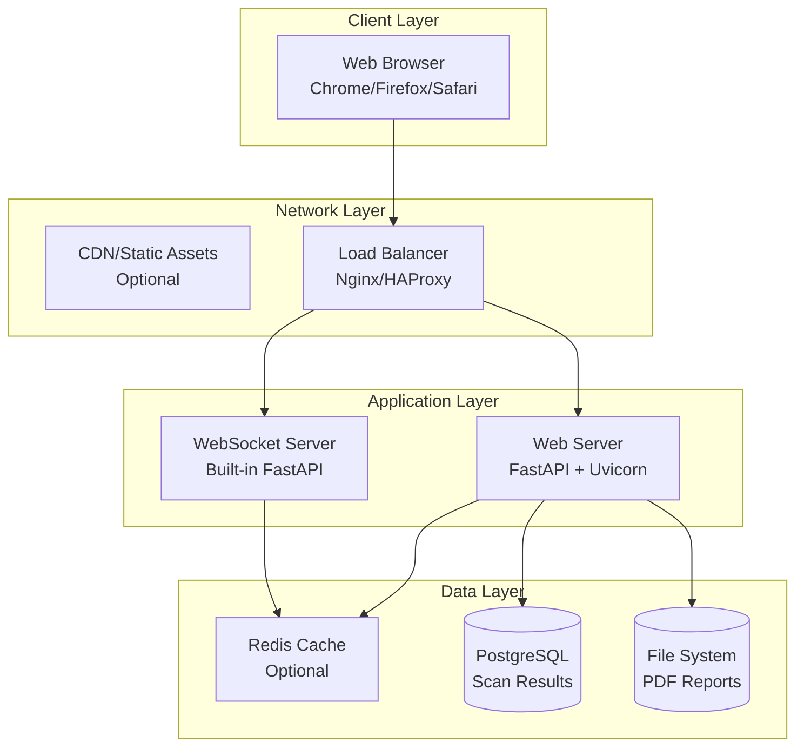

# AIVULNHUNTER - Detailed Architecture Diagram

## System Overview

AIVULNHUNTER is a multi-agent AI-powered vulnerability assessment framework designed to identify security vulnerabilities in AI/ML systems, particularly Large Language Models (LLMs) and their APIs. The system combines real-time testing, reinforcement learning, and explainable AI to provide comprehensive security analysis.

## High-Level Architecture



## Detailed Workflow Diagram

```mermaid
flowchart TD
    A[User Login<br/>JWT Authentication] --> B[Dashboard Access]
    B --> C[Target Input<br/>URL/API Endpoint]

    C --> D[Scan Initiation<br/>POST /scan]
    D --> E[WebSocket Connection<br/>ws://localhost:8000/ws/scan/{id}]

    E --> F[Target Profiling Agent<br/>25% Progress]
    F --> F1[HTTP Probing<br/>Reachability Check]
    F1 --> F2[Type Detection<br/>LLM/API/Web App]
    F2 --> F3[Risk Assessment<br/>HIGH/MEDIUM/LOW]
    F3 --> F4[Profile Storage<br/>SCANS_DB[id]]

    F4 --> G[Attack Strategy Agent<br/>50% Progress]
    G --> G1[Rule Loading<br/>backend/rules/rules.json]
    G2[Rule Filtering<br/>By Target Type]
    G1 --> G2
    G2 --> G3[Priority Sorting<br/>Severity + RL Scores]
    G3 --> G4[Attack Plan Creation<br/>Selected Rules List]

    G4 --> H[Executor Agent<br/>55-75% Progress]
    H --> H1[Rule Execution Loop<br/>For Each Selected Rule]

    H1 --> I[Real-time Testing<br/>HTTP Requests to Target]
    I --> I1[LLM01: Prompt Injection<br/>Injection Payloads]
    I --> I2[LLM02: Output Handling<br/>Content Filtering]
    I --> I3[LLM04: DoS Testing<br/>Rate Limiting Check]
    I --> I4[LLM06: Info Disclosure<br/>Sensitive Data Leakage]

    I1 --> J[Execution Results<br/>Status + Evidence]
    I2 --> J
    I3 --> J
    I4 --> J

    J --> K[Observer Agent<br/>90-100% Progress]
    K --> K1[XAI Analysis<br/>Vulnerability Explanation]
    K1 --> K2[Confidence Scoring<br/>Evidence-based Assessment]
    K2 --> K3[Mitigation Recommendations<br/>Actionable Steps]

    K3 --> L[Reinforcement Learning Update<br/>Rule Priority Adjustment]
    L --> L1[Success/Failure Tracking<br/>Per Rule Performance]
    L1 --> L2[RL Score Update<br/>backend/rl/rule_scores.json]

    L2 --> M[PDF Report Generation<br/>ReportLab Library]
    M --> M1[Target Summary<br/>Profile + Risk Level]
    M1 --> M2[Rules Applied<br/>OWASP Categories]
    M2 --> M3[Vulnerabilities Found<br/>Severity + Confidence]
    M3 --> M4[Mitigation Steps<br/>Detailed Recommendations]
    M4 --> M5[Report Storage<br/>reports/scan_{id}.pdf]

    M5 --> N[Results Storage<br/>SCANS_DB[id] Complete]
    N --> O[WebSocket Completion<br/>100% Progress]
    O --> P[Frontend Display<br/>Results Dashboard]
    P --> Q[Report Download<br/>GET /scan/{id}/report]

    R[Admin Panel] --> S[Rule Management<br/>CRUD Operations]
    S --> T[Rule Addition/Editing<br/>OWASP Categories]
    T --> U[Enable/Disable Rules<br/>Dynamic Configuration]

    V[RL Statistics] --> W[Rule Performance<br/>Success Rates]
    W --> X[Priority Adjustments<br/>Learning Visualization]
```

## Component Details

### 1. Frontend Layer

**Technologies:** HTML5, CSS3, JavaScript, React/Vue.js
**Components:**
- `index.html` - Landing page
- `admin_login.html` - Authentication
- `scan.html` - Vulnerability scanner UI
- `admin.html` - Rule management interface
- `agents.html` - Agent information display
- `rl.html` - RL statistics dashboard

**Key Features:**
- Real-time progress visualization via WebSocket
- Interactive agent timeline
- PDF report download
- JWT token management
- Responsive design

### 2. Backend API Layer

**Framework:** FastAPI (Python 3.10+)
**Endpoints:**
- `POST /admin/login` - JWT authentication
- `GET /admin/me` - User verification
- `GET /rules/` - List security rules
- `POST /rules/` - Create new rule
- `PUT /rules/{id}` - Update rule
- `DELETE /rules/{id}` - Delete rule
- `POST /scan` - Initiate vulnerability scan
- `GET /scan/{id}` - Get scan results
- `GET /scan/{id}/report` - Download PDF report
- `WS /ws/scan/{id}` - Real-time progress updates

**Middleware:**
- CORS support for frontend communication
- JWT authentication guards
- Request validation with Pydantic

### 3. Multi-Agent System

#### Target Profiling Agent
**Input:** Target URL
**Process:**
- HTTP GET request with timeout
- URL pattern analysis
- Response header inspection
- Content-type detection
**Output:** Target profile (type, risk, reachability)

#### Attack Strategy Agent
**Input:** Target profile, rules database
**Process:**
- Rule filtering by target type
- Priority sorting by severity + RL scores
- Risk-based rule selection
**Output:** Attack execution plan

#### Executor Agent
**Input:** Attack plan, target URL
**Process:**
- Real-time HTTP requests to target
- Vulnerability-specific test payloads
- Response analysis for vulnerability indicators
- Evidence collection
**Output:** Test results with confidence scores

#### Observer Agent
**Input:** Execution results
**Process:**
- XAI analysis of findings
- Confidence score calculation
- Mitigation recommendation generation
- RL feedback preparation
**Output:** Analyzed vulnerabilities with explanations

### 4. Intelligence Components

#### Reinforcement Learning Engine
**Purpose:** Dynamic rule prioritization
**Algorithm:** Reward-based learning
**Input:** Rule performance (success/failure)
**Process:**
- Score updates based on detection effectiveness
- Priority adjustments for future scans
**Output:** Updated rule priorities

#### Explainable AI Engine
**Purpose:** Vulnerability explanation
**Input:** Raw test results
**Process:**
- Evidence correlation
- Confidence assessment
- Mitigation mapping
**Output:** Human-readable explanations

#### Security Rules Database
**Format:** JSON configuration
**Categories:** OWASP LLM Top 10
**Structure:**
```json
{
  "id": "1",
  "name": "Prompt Injection",
  "owasp": "LLM01",
  "severity": "HIGH",
  "priority": 4,
  "enabled": true
}
```

### 5. Data Storage Layer

#### Scan Results Database
**Technology:** In-memory (SCANS_DB) or persistent
**Structure:**
```python
{
  "scan_id": "uuid",
  "target": "url",
  "status": "success|error|running",
  "profile": {...},
  "results": [...],
  "rl_scores": {...}
}
```

#### Rule Scores Cache
**File:** `backend/rl/rule_scores.json`
**Purpose:** RL-learned priorities
**Format:**
```json
{
  "LLM01": 0.85,
  "LLM02": 0.72
}
```

#### PDF Reports Storage
**Directory:** `reports/`
**Format:** PDF generated by ReportLab
**Contents:** Executive summary, detailed findings, mitigations

## Data Flow

### Input Processing
1. **User Input:** Target URL via web form
2. **Authentication:** JWT token validation
3. **Validation:** URL format and reachability check
4. **Queueing:** Scan request added to processing pipeline

### Processing Pipeline
1. **Profiling:** Real-time target analysis (25%)
2. **Strategy:** Rule selection and planning (50%)
3. **Execution:** Vulnerability testing (55-75%)
4. **Analysis:** Results interpretation (90-100%)
5. **Learning:** RL updates and report generation

### Output Generation
1. **Real-time Updates:** WebSocket progress messages
2. **JSON Results:** Structured vulnerability data
3. **PDF Reports:** Comprehensive security assessment
4. **Database Storage:** Scan history and analytics

## Security Considerations

### Authentication & Authorization
- JWT-based authentication with role management
- Admin-only access for rule management
- Token expiration and refresh mechanisms

### Input Validation
- URL format validation
- Request size limits
- Content-type restrictions

### Rate Limiting
- API endpoint throttling
- WebSocket connection limits
- Scan frequency controls

### Data Protection
- No sensitive data storage
- Secure PDF generation
- Audit logging for admin actions

## Deployment Architecture



## Performance Characteristics

### Response Times
- **Target Profiling:** 2-5 seconds (HTTP timeout)
- **Rule Execution:** 5-15 seconds per rule
- **Report Generation:** 2-5 seconds
- **Total Scan Time:** 30-120 seconds

### Scalability Considerations
- **Concurrent Scans:** Limited by agent orchestration
- **WebSocket Connections:** One per active scan
- **Database Load:** Write-heavy during scans
- **Storage Growth:** PDF files accumulate over time

### Monitoring Points
- API response times
- WebSocket connection health
- Agent execution success rates
- RL learning convergence
- Report generation success

## Future Enhancements

### Planned Features
- **Distributed Agents:** Multi-server agent deployment
- **Advanced RL:** Deep reinforcement learning models
- **Integration APIs:** Third-party security tool integration
- **Scheduled Scans:** Automated periodic assessments
- **Custom Rules:** User-defined vulnerability patterns

### Scalability Improvements
- **Microservices:** Agent decomposition
- **Message Queues:** Async processing pipeline
- **Database Sharding:** Multi-tenant support
- **CDN Integration:** Global deployment support

---

*This architecture diagram provides a comprehensive view of the AIVULNHUNTER system, detailing the workflow from user input through vulnerability detection to report generation. The multi-agent design enables sophisticated AI-powered security testing while maintaining real-time user feedback and explainable results.*
